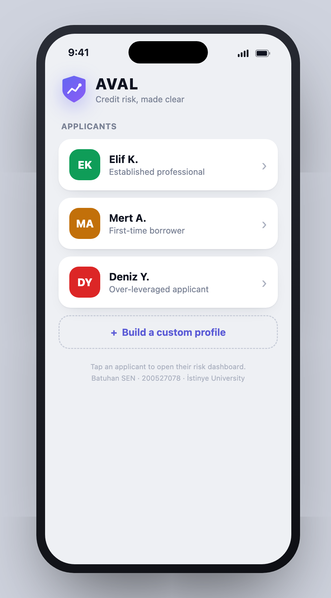
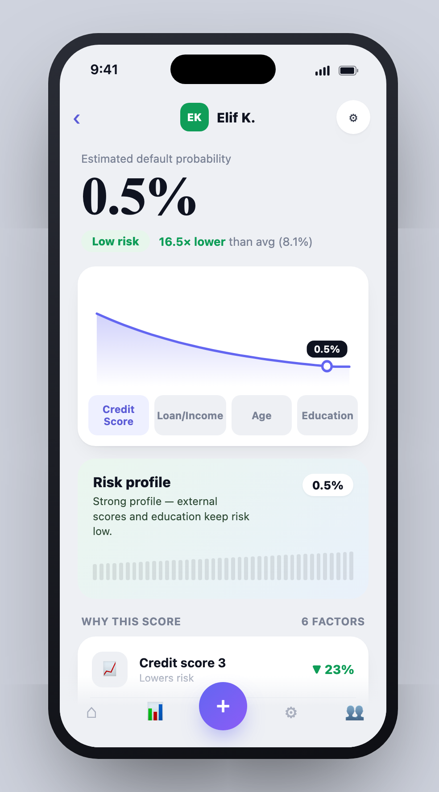
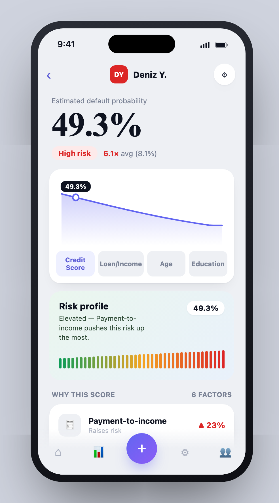

# The Impact of Machine Learning-Based Credit Scoring Models on the Accuracy of Loan Default Prediction in Banking

**BA Degree Project II · İstinye University**
**Batuhan ŞEN · 200527078**

This repository contains the full graduation project: the thesis document, the reproducible machine-learning pipeline, the analysis notebooks, the presentation, and two interactive demo applications built on the trained model.

---

## 🎯 Research question

> *To what extent do machine-learning credit scoring models improve loan-default prediction over the traditional logistic-regression baseline — and what practical constraints accompany them?*

## 🔑 Key finding — "The Imbalance Trap"

Four models (Logistic Regression, Random Forest, XGBoost, LightGBM) were compared on the Home Credit Default Risk dataset. The headline result depends on a choice most studies never question — the **class-imbalance handling strategy**:

| Model | No handling | SMOTE | Class-weight |
|---|---|---|---|
| Logistic Regression | 0.7408 | **0.7389** | 0.7410 |
| Random Forest | 0.7367 | 0.6999 | 0.7382 |
| XGBoost | **0.7472** | 0.7055 | 0.7437 |
| LightGBM | 0.7447 | 0.7216 | **0.7450** |

*Cross-validation AUC. Under SMOTE the simple model "wins"; SMOTE silently damages the tree models (XGBoost −0.042). With honest cost-sensitive weighting, boosting wins back — but only by ~0.006 AUC.*

**The method mattered more than the model.** In regulated banking, where decisions must be explained, this margin may not justify a black-box model — careful data preparation, honest imbalance handling, and feature engineering proved at least as consequential as the algorithm.

## 📱 Interactive demos

| App | What it shows |
|---|---|
| [`app/AVAL.html`](app/AVAL.html) | **AVAL — "credit risk, made clear."** The trained model behind a real banking-app interface: tap an applicant → instant default probability **and the reasons** (interpretability live). Simplified 9-feature logistic model, test AUC ≈ 0.72. |
| [`app/imbalance_trap_mobile.html`](app/imbalance_trap_mobile.html) | **The Imbalance Trap** — switch the imbalance strategy and watch the model leaderboard re-rank itself live. The thesis's key finding as an interactive tool. |

Both are single-file apps — just open them in a browser. No install, no server.

<p align="center">
  
  
  
</p>

## 📁 Repository structure

```
├── document/
│   └── 200527078_BatuhanSEN_BADegreeProjectFinalDocument.docx   # final thesis (82 pages)
├── presentation/BA_Degree_slides.pptx                           # 13-slide defense deck
├── credit_scoring_pipeline.py                                   # end-to-end pipeline (one command)
├── notebooks/                                                   # EDA → preprocessing → modeling
├── app/                                                         # AVAL + Imbalance Trap demos (+ screenshots)
├── outputs/figures/                                             # all thesis figures
├── outputs/results/                                             # feature selection & robustness results
└── requirements.txt                                             # pinned environment (122 packages)
```

## 🔁 Reproducing the analysis

The dataset is **not** included (Kaggle competition rules do not allow redistribution).

1. Download `application_train.csv` from the Kaggle competition [Home Credit Default Risk](https://www.kaggle.com/c/home-credit-default-risk) (accept the rules first) and place it in `data/`.
2. Create the environment:
   ```bash
   python3 -m venv venv && source venv/bin/activate
   pip install -r requirements.txt
   ```
3. Run the full pipeline (loads, cleans, splits leakage-safe, selects features with Boruta, tunes and evaluates all four models, saves figures and tables):
   ```bash
   PIPE_SAMPLE=50000 python credit_scoring_pipeline.py
   ```
   `random_state=42` everywhere — results regenerate identically.

## 🛠️ Method summary

Home Credit Default Risk (307,511 applications, 122 variables, 8.07% default) → cleaning (60%-missing column removal, `DAYS_EMPLOYED` placeholder fix, winsorization, engineered banking ratios) → leakage-safe 80/20 stratified split → encoding (one-hot + target) → feature selection (near-zero variance, |r|>0.85, **Boruta**: 146 → 23) → 4 models tuned with RandomizedSearchCV (5-fold stratified CV, AUC) → paired t-tests (Bonferroni) → **SHAP** interpretability → robustness analysis across imbalance strategies.

---

*Submitted in partial fulfillment of the BA Degree Project II requirement, Management Information Systems, İstinye University, June 2026.*
